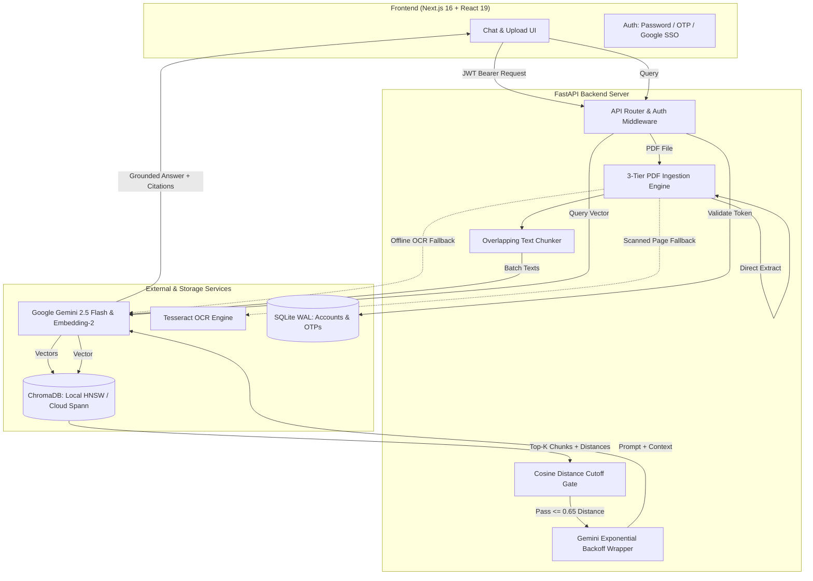

# ⚡ Enterprise RAG Platform

> **Production-grade Retrieval-Augmented Generation (RAG) system with hybrid OCR fallback, strict cosine distance gating, multi-tenant isolation, and multi-method authentication.**

[](https://rag-app-blush.vercel.app)
[](https://fastapi.tiangolo.com)
[](https://nextjs.org)
[](https://react.dev)
[](https://ai.google.dev)
[](https://www.trychroma.com)
[](https://www.docker.com)

---

## 🎯 What Is This & Why Does It Exist?

Most RAG tutorials on GitHub and the web are brittle toy scripts: they choke on scanned PDFs, mix all user data into a shared vector index, hallucinate when queries are out-of-domain, and lack real authentication or rate handling.

This platform is engineered as a **complete, full-stack, enterprise-ready document intelligence system**. It allows users to securely upload complex PDF documents and ask questions in natural language, receiving **strictly grounded, cited answers** backed by Google Gemini and vector similarity search.

---

## ⚡ How Is It Different From Other RAG Tools On The Internet?

| Dimension | Generic Open-Source / Tutorial RAG | This Platform |
| :--- | :--- | :--- |
| **PDF Ingestion & OCR** | Uses naive text extractors (`pypdf`, `pdfplumber`); completely breaks on scanned docs and image-only pages. | **3-Tier Resilient Ingestion:** Fast digital extraction with **PyMuPDF**, automated fallback to **Tesseract OCR (200 DPI)** for scanned pages, and cloud fallback to **Gemini Multimodal PDF transcription**. |
| **Hallucination Control** | Blindly injects top-$K$ vectors into LLM context, causing hallucinations even when docs don't contain answers. | **Cosine Distance Gating:** Strict distance cutoff (`MAX_DISTANCE = 0.65`). If relevance fails threshold, execution halts immediately with zero LLM spend and zero hallucination. |
| **Multi-Tenancy & Privacy** | Single-user or global vector index; anyone can search everyone's uploaded files. | **Strict Tenant Isolation:** Every chunk is isolated with `user_id` metadata. All queries, listing, and deletions enforce strict user boundaries. |
| **Authentication** | None, mock passwords, or hardcoded API keys. | **Multi-Modal Auth Suite:** Password auth (`scrypt` hashing with WAL SQLite), **Google OAuth SSO** verification, passwordless **6-digit Email OTP** (SMTP), and **7-day JWT Bearer tokens**. |
| **Vector Storage Topology** | Hardcoded local SQLite file that crashes stateless cloud containers. | **Dual-Engine Architecture:** Seamlessly toggles between **Chroma Cloud** (`Spann` cosine index for stateless servers) and **Local ChromaDB** (`HNSW` cosine index on disk). |
| **API Resilience** | Crashes on Gemini 429 quota spikes or transient 503 network drops. | **Exponential Backoff Engine:** Built-in auto-retry loop with exponential backoff handling transient rate limits and quota spikes. |
| **UX & Frontend** | Barebones Gradio or unstyled Streamlit wrapper. | **Next.js 16 + Tailwind CSS v4 SPA:** Dark/light mode, Markdown rendering, passage citations drawer, one-click copy, and document chunk manager. |

---

## 🏗️ Architecture & Pipeline Flow



---

## 🚀 Core Features

### 1. 3-Tier Document Ingestion Pipeline
- **Digital Extraction:** Ultra-fast page-by-page text scraping using `pymupdf` (Fitz).
- **Embedded OCR:** Automatically detects pages lacking selectable text, rasterizes them at 200 DPI, and extracts characters using `pytesseract`.
- **Vision Fallback:** If Tesseract is not installed on the host OS, it streams the document directly to Gemini's multimodal API for lossless optical transcription.
- **Intelligent Chunking:** Configurable chunk windows (default `1800` chars with `180` char sliding overlap) to preserve semantic coherence across chunk boundaries.

### 2. Strict Hallucination Guardrails
- **Pre-flight Gating:** Checks if user has documents before calling embedding services.
- **Cosine Metric Distance Validation:** Discards any chunk exceeding the distance threshold ($0.65$), preventing irrelevant context injection.
- **Strict Grounding Prompting:** Instructs Gemini to answer *only* from supplied excerpts; otherwise it outputs a standardized refusal string.

### 3. Complete Document Lifecycle Management
- **Live Document Inventory:** View all uploaded files with real-time vector chunk counts.
- **Atomic Deletions:** Delete a document to cleanly wipe its indexed chunks from ChromaDB without corrupting the index.
- **Duplicate Overwriting:** Re-uploading a file with the same name automatically purges outdated chunks before indexing the new version.

### 4. Enterprise-Grade Authentication Suite
- **Password Auth:** Hardened with `scrypt` hashing ($N=16384, r=8, p=1$).
- **Google One-Tap / OAuth:** Server-side token validation using Google's public key certificate authorities.
- **Passwordless Email OTP:** 6-digit one-time password system with customizable SMTP relay, attempt throttling, and development debug mode.
- **Stateless JWT Sessions:** 7-day bearer tokens compatible with decoupled Vercel + Render deployments.

---

## 🛠️ Tech Stack

### Frontend
- **Framework:** [Next.js 16](https://nextjs.org) (App Router, Server Components & Client Hooks)
- **Library:** [React 19](https://react.dev)
- **Language:** [TypeScript 5](https://www.typescriptlang.org)
- **Styling:** [Tailwind CSS v4](https://tailwindcss.com) (Vanilla PostCSS configuration)
- **Markdown & Highlighting:** `react-markdown` with code highlighting & citation details drawer

### Backend
- **Framework:** [FastAPI](https://fastapi.tiangolo.com) (High-performance asynchronous Python web framework)
- **Server:** [Uvicorn](https://www.uvicorn.org)
- **PDF Extraction:** [PyMuPDF (Fitz)](https://pymupdf.readthedocs.io), [Pillow](https://python-pillow.org), [pytesseract](https://pypi.org/project/pytesseract/)
- **Auth & Crypto:** `PyJWT`, `google-auth`, Python `hashlib` (scrypt), SQLite3 (WAL mode)

### AI & Vector Systems
- **LLM Engine:** [Google Gemini 2.5 Flash](https://ai.google.dev) (`gemini-2.5-flash`)
- **Embedding Model:** Google `gemini-embedding-2` (768-dimensional normalized vectors)
- **Vector Database:** [ChromaDB](https://www.trychroma.com) (supports local persistent disk and Chroma Cloud)

### Infrastructure & Deployment
- **Containerization:** Multi-stage Docker container with Debian Tesseract OCR dependencies
- **Hosting:** [Vercel](https://vercel.com) (Frontend Edge), [Render](https://render.com) (Docker Backend Web Service)

---

## 📂 Repository Structure

```text
rag-app/
├── backend/
│   ├── auth.py              # Account auth, Google OAuth, Email OTP, JWT & SQLite store
│   ├── main.py              # FastAPI endpoints, OCR pipeline, ChromaDB & Gemini RAG
│   ├── Dockerfile           # Python 3.12 slim image + tesseract-ocr system packages
│   ├── requirements.txt     # Python dependencies
│   └── .env                 # Backend environment secrets
│
├── frontend/
│   ├── src/
│   │   ├── app/
│   │   │   ├── layout.tsx   # Root layout & metadata
│   │   │   └── page.tsx     # Main dashboard & application container
│   │   ├── components/
│   │   │   ├── AuthForm.tsx # Modal: Email/Password, OTP, and Google OAuth
│   │   │   ├── Chat.tsx     # Chat messages, citations drawer, Markdown renderer
│   │   │   ├── Sidebar.tsx  # Document manager & chunk counter
│   │   │   └── Header.tsx   # Brand navbar, theme toggle, and profile
│   │   └── lib/
│   │       ├── api.ts       # Backend REST client & error handler
│   │       └── auth.ts      # Browser session storage & token lifecycle
│   ├── package.json
│   └── tailwind.config.ts
│
├── render.yaml              # Render blueprint for zero-touch cloud deployment
└── README.md                # Project documentation
```

---

## 📡 API Reference

| Method | Endpoint | Auth | Description |
| :--- | :--- | :---: | :--- |
| `GET` | `/health` | No | Liveness and health check probe |
| `POST` | `/auth/register` | No | Register new account with email & password |
| `POST` | `/auth/login` | No | Login with email & password (returns JWT) |
| `POST` | `/auth/otp/send` | No | Request 6-digit email OTP (via SMTP) |
| `POST` | `/auth/otp/verify` | No | Verify 6-digit OTP and issue JWT |
| `POST` | `/auth/google` | No | Verify Google OAuth credential token |
| `GET` | `/auth/me` | Bearer | Get authenticated user identity |
| `POST` | `/upload` | Bearer | Ingest PDF (extracts, OCRs, chunks, embeds, indexes) |
| `GET` | `/documents` | Bearer | List user documents with chunk counts |
| `DELETE` | `/documents/{filename}` | Bearer | Delete document and remove vectors |
| `POST` | `/chat` | Bearer | Query documents with similarity search & Gemini answer |

---

## ⚙️ Environment Variables

### Backend (`backend/.env`)
```bash
# Gemini AI Configuration
GEMINI_API_KEY="your-gemini-api-key"
EMBEDDING_MODEL="models/gemini-embedding-2"
EMBEDDING_DIM="768"
GENERATION_MODEL="gemini-2.5-flash"

# RAG Tuning Parameters
CHUNK_SIZE="1800"
CHUNK_OVERLAP="180"
MAX_DISTANCE="0.65"
MAX_UPLOAD_MB="20"

# Vector Database (Local or Chroma Cloud)
CHROMA_PATH="./chroma_db"
# Optional Chroma Cloud:
# CHROMA_API_KEY="your-chroma-cloud-key"
# CHROMA_TENANT="default_tenant"
# CHROMA_DATABASE="default_database"

# Security & Authentication
AUTH_SECRET="your-32-plus-char-jwt-secret-key"
AUTH_DB_PATH="./auth.db"
ALLOWED_ORIGINS="*"

# Optional Google SSO & SMTP OTP
GOOGLE_CLIENT_ID="your-google-client-id"
SMTP_HOST="smtp.gmail.com"
SMTP_PORT="587"
SMTP_USER="your-email@gmail.com"
SMTP_PASSWORD="your-app-password"
SMTP_FROM="noreply@yourdomain.com"
```

### Frontend (`frontend/.env.local`)
```bash
NEXT_PUBLIC_API_URL="http://localhost:8000"
NEXT_PUBLIC_GOOGLE_CLIENT_ID="your-google-client-id"
```

---

## 🚀 Getting Started

### Prerequisites
- **Python 3.11+**
- **Node.js 18+** & `npm`
- *(Optional)* **Tesseract OCR** on local machine (falls back automatically to Gemini Vision if omitted)

---

### Local Development

#### 1. Clone the repository
```bash
git clone https://github.com/subornoroychowdhury7-afk/rag_app.git
cd rag_app
```

#### 2. Start the Backend
```bash
cd backend

# Create and activate virtual environment
python -m venv venv
# Windows:
.\venv\Scripts\activate
# Linux/macOS:
# source venv/bin/activate

# Install dependencies
pip install -r requirements.txt

# Configure environment
cp .env.example .env   # Or create .env with GEMINI_API_KEY and AUTH_SECRET

# Run FastAPI server
uvicorn main:app --reload --host 0.0.0.0 --port 8000
```
Backend runs at `http://localhost:8000` (Interactive Swagger docs available at `http://localhost:8000/docs`).

#### 3. Start the Frontend
```bash
cd ../frontend

# Install packages
npm install

# Configure environment
cp .env.example .env.local

# Run Next.js development server
npm run dev
```
Frontend runs at `http://localhost:3000`.

---

### Running with Docker

Run the backend containerized with full Tesseract OCR pre-installed:

```bash
docker build -f backend/Dockerfile -t rag-backend .
docker run -p 8000:8000 \
  -e GEMINI_API_KEY="your_gemini_api_key" \
  -e AUTH_SECRET="your_secret_key" \
  rag-backend
```

---

## 🔒 Security & Data Privacy

- **Zero Outside Contamination:** User documents are partitioned by strictly validated account IDs in the vector database.
- **Passphrase Cryptography:** Password credentials are stored as salted PBKDF2/scrypt hashes and never logged.
- **Token Security:** Bearer tokens are kept in tab-isolated browser session storage and expire automatically after 7 days.
- **Rate & Size Throttling:** Upload payloads are capped at 20 MB; incoming chat prompts are capped at 2,000 characters to prevent prompt injection and Denial-of-Service attacks.

---

## 📄 License

Distributed under the **MIT License**. See `LICENSE` for more information.
